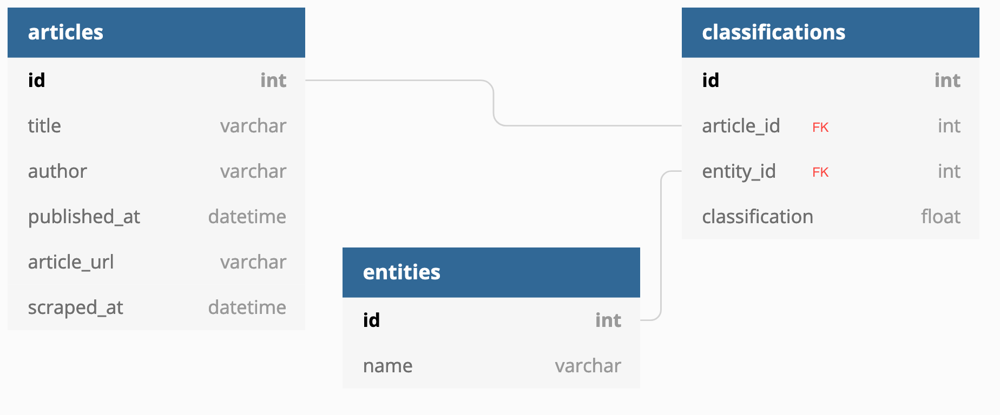

# DB Application
> Gabe Joy and Alexander Powers

### Setup
```bash
# move to db_application folder
cd thee-flying-chicken/db_application
# create an empty venv
virtualenv venv
# activate the venv
source ./venv/bin/activate
# install project dependencies
pip install -r requirements.txt
```

### Run the App
```bash
# move to db_application folder
cd thee-flying-chicken/db_application 
# activate the venv
source ./venv/bin/activate
# run the app
python app.py
```

### ER as of 20190325
